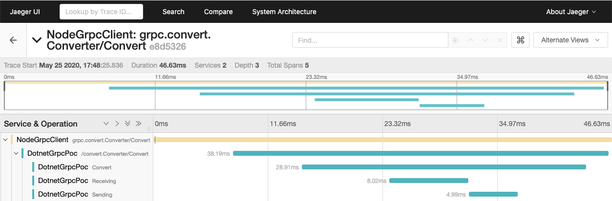

# Dev Log

## 2020-04-27

Installed `dotnet` toolchain with homebrew:

```bash
brew cask install dotnet-sdk
```

Created the repo with:

```bash
dotnet new grpc -o dotnet-grpc-poc
cd dotnet-grpc-poc
code -r .
```

Vs code did some stuff:

```
Installing C# dependencies...
Platform: darwin, x86_64

Downloading package 'OmniSharp for OSX' (47441 KB).................... Done!
Validating download...
Integrity Check succeeded.
Installing package 'OmniSharp for OSX'

Downloading package '.NET Core Debugger (macOS / x64)' (41849 KB).................... Done!
Validating download...
Integrity Check succeeded.
Installing package '.NET Core Debugger (macOS / x64)'

Downloading package 'Razor Language Server (macOS / x64)' (51065 KB).................... Done!
Installing package 'Razor Language Server (macOS / x64)'

Finished
```

It also asked for help on something that disappeared rather quickly...

Installed `vscode-proto3` to get some protobuf highlighting

Apparently, you have to turn off TLS for MacOS grpc dev?

```
// Additional configuration is required to successfully run gRPC on macOS.
// For instructions on how to configure Kestrel and gRPC clients on macOS, visit https://go.microsoft.com/fwlink/?linkid=2099682
```

After following the instructions and creating a non-TLS endpoint, `dotnet run`
works.  The instructions were to allow a TLS override for localhost.

---

Added a tool manifest and dotnet format:

```bash
dotnet new tool-manifest
dotnet tool install dotnet-format
```

Added a `Makefile` to make running some scripts easier.  Can run format from
it:

```bash
make fmt
```

---

Apparently I didn't setup my project with the correct format? In order to have
tests I should have a project folder for my service ***AND*** my tests.

How I fixed:

* Recreate the project in a src folder:
  ```bash
  dotnet new grpc -o src/DotnetGrpcPoc
  ```
  Applied fixes from above
* Modify `Makefile` `fmt` script:
  ```bash
  dotnet tool run dotnet-format -f .
  ```
  Formats the entire directory tree
* Add new `run` convenience script
  ```
  make run
  dotnet run --project src/DotnetGrpcPoc/
  ```

Now to add some tests...

* Add a tests folder that follows the dotnet convention
  ```bash
  dotnet new xunit -o tests/DotnetGrpcPoc.Tests
  ```
* Add a reference from the unit test folder to the project src
  ```bash
  cd tests/DotnetGrpcPoc.Tests
  dotnet add reference ../../src/DotnetGrpcPoc/DotnetGrpcPoc.csproj
  ```
* Add new `test` convenience script
  ```
  make test
  dotnet run --project src/DotnetGrpcPoc/
  ```

---

Started my integration test implementation by hacking together a test file,
which meant I needed the GRPC client working correctly in the context of the
testing package.  I had to add several packages:

```
cd tests/DotnetGrpcPoc.Tests/
dotnet add package Google.Protobuf
dotnet add package Grpc.Net.Client
dotnet add package Grpc.Tools
dotnet add package Microsoft.AspNetCore.TestHost
dotnet add package FluentAssertions

```

And added a protobuf reference for `greet.proto` to the test csproj file:

```xml
  <ItemGroup>
    <Protobuf Include="..\..\src\DotnetGrpcPoc\Protos\greet.proto" GrpcServices="Client">
      <Link>proto\greet.proto</Link>
    </Protobuf>
  </ItemGroup>
```

While the simple unit tests worked correctly, I had a hell of a time trying to
get a service integration test working correctly:

```
A total of 1 test files matched the specified pattern.
[xUnit.net 00:00:00.77]     DotnetGrpcPoc.Tests.ServiceTests.Test_HelloWorld [FAIL]
  X DotnetGrpcPoc.Tests.ServiceTests.Test_HelloWorld [81ms]
  Error Message:
   Grpc.Core.RpcException : Status(StatusCode=Internal, Detail="Bad gRPC response. Response protocol downgraded to HTTP/1.1.
```

This turned out to be a bug!

https://github.com/dotnet/aspnetcore/issues/16940

The `TestServer` implementation wasn't properly setting the HTTP version being
sent.

After implementing the override found in:

https://github.com/grpc/grpc-dotnet/blob/cf09aafcedd306743f35094f04e473abf5aa41a5/examples/Tester/Tests/FunctionalTests/Helpers/GrpcTestFixture.cs

Everything works correctly.

---

Realized I should have a solution file to tie my subprojects together. Created
by running:

```bash
dotnet new sln
dotnet sln add src/DotnetGrpcPoc/
dotnet sln add tests/DotnetGrpcPoc.Tests/
```

Can now run commands like `dotnet test` in the top level directory and it just
works.

Might not need `make`?

---

## 2020-05-11

`dotnet` has lockfiles for dependencies?

Generate the lockfiles for everything in the solution:

```bash
dotnet restore --use-lock-file
```

Restore deps from only their locked versions:

```bash
dotnet restore --locked-mode
```

---

Added a Bidirectional streaming service (meant to run the imagemagick `convert`
tool eventually). This is kind of a pain, as we need to do a little bit of
bookkeeping to get working correctly.

Simple echo stream:

```csharp
public override async Task Convert(
    IAsyncStreamReader<Chunk> requestStream,
    IServerStreamWriter<Chunk> responseStream,
    ServerCallContext context)
{
    // Echo back bytes
    while(await requestStream.MoveNext())
    {
        await responseStream.WriteAsync(requestStream.Current);
    }
}
```

---

Got the bidirectional convert service functioning. Piping binary data to / from
external processes was not intuitive.  Apparently you need to pull off the
`BaseStream` of the process wrapped streams:

```csharp
var standardInput = convertProcess.StandardInput.BaseStream;
var standardOutput = convertProcess.StandardOutput.BaseStream;
```

This results in a `System.IO.Stream` that exposes / consumes `byte[]`.

Unfortunately, this whole process results in copying byte buffers in the server
and client. I don't think this can be helped for gRPC.

In the end, everything works.  I have a service that accepts streaming image
data, takes that streamed series of bytes passes them into the imagemagick cli,
and converts it to a png. Piping the resulting image back.

One strange thing to figure out was how to test / query the resulting image
data. This could change out from under me. I settled on
[ImageSharp](https://github.com/SixLabors/ImageSharp), which was more finicky
to install than I would have hoped. I was required to specify a previous
prerelease version for install to work correctly:

```bash
dotnet add tests/DotnetGrpcPoc.Tests/ package SixLabors.ImageSharp -v 1.0.0-beta0007
```

Once I had this setup, it was easy to load the resulting image data from a
`byte[]` and query it.

---

## 2020-05-12

Added a node client!

I ended up going with the dynamically generated client (from the proto file)
based on the example here:

https://github.com/grpc/grpc/blob/cb81fe0dfaa424eb50de26fb7c904a27a78c3f76/examples/node/dynamic_codegen/greeter_client.js

`make test` will now run both the dotnet tests, and full integration tests with
the node client and dotnet server.

This probably isn't as clean as I want it. I've already noticed a few issues:

* No way to cancel the server side stream
* No way to get error messages / codes to the client
* The streaming api is a little obtuse
* Names and casing apparently matters in the proto files

The solutions to some of these might be to add some properties / enums to the
protobuf definition.  It also seems like struct properties should be lower case
in the proto files for consistency.

---

## 2020-05-25

Added [OpenTelemetry](https://opentelemetry.io/) tracing to the app. Sending
data to [Jaeger](https://www.jaegertracing.io/).

The benefit of using OpenTelemetry is that you can switch out the underlying
exporter.

OpenTelemetry is pretty early in it's development so we have to add prerelease
packages from myget:

```bash
dotnet nuget add source -n "OpenTelemetry" https://www.myget.org/F/opentelemetry/api/v3/index.json
```

Then we can install all our required packages:

```bash
dotnet add package OpenTelemetry.Api -v 0.2.0-alpha.296
dotnet add package OpenTelemetry.Exporter.Jaeger -v 0.2.0-alpha.296
dotnet add package OpenTelemetry.Extensions.Hosting -v 0.2.0-alpha.296
dotnet add package OpenTelemetry.Instrumentation.AspNetCore -v 0.2.0-alpha.296
dotnet add package OpenTelemetry.Instrumentation.Dependencies -v 0.2.0-alpha.296
```

The documentation for OpenTelemetry for dotnet are a little sparse, and to find
out *why* all these packages are necessary, I had to dig around in the
OpenTelemetry example code.

For an explanation:

`OpenTelemetry.Api` - This is core

`OpenTelemetry.Exporter.Jaeger` - Need this to export to Jaeger

`OpenTelemetry.Extensions.Hosting` - This is required to hook the web `Startup`
configuration

`OpenTelemetry.Instrumentation.AspNetCore` - This is required to automatically
generate tracing spans for every request

`OpenTelemetry.Instrumentation.Dependencies` - This is required to
automatically create tracing spans for dependencies (I don't really have any
dependencies that use this yet, but I thought I should add it).

From `Startup.cs`:

```csharp
public void ConfigureServices(IServiceCollection services)
{
    // OpenTelemetry.Extensions.Hosting adds this method
    services.AddOpenTelemetry((sp, builder) =>
    {
        // Sample everything
        builder.SetSampler(new AlwaysOnSampler())
        .UseJaeger(o =>
        {
            o.ServiceName = "DotnetGrpcPoc";
            o.AgentHost = "localhost";
            o.AgentPort = 6831;
        })
        // OpenTelemetry.Instrumentation.AspNetCore adds this method
        .AddRequestInstrumentation()
        // OpenTelemetry.Instrumentation.Dependencies adds this method
        .AddDependencyInstrumentation();
    });
}
```

Now that all the configration is in place, we can run Jaeger to see traces get
populated:

```bash
docker run -d --name jaeger -p 6831:6831/udp -p 16686:16686 jaegertracing/all-in-one:1.18
```

- Port `6831` is the port udp traces are sent to the collector
- Port `16686` is the web interface

I made a `Makefile` target to make starting this easy:

```bash
make run-jaeger
```

With Jaeger running, we can re-run our test suite and see traces populate for
the base calls.

Next, we want to add custom spans to our service calls.  With our current
config, the tracer factory is injected into every service, and we can stash a
reference to the tracer object in our constructor:

```csharp
private readonly Tracer _tracer;
public SomeService(TracerFactory tracerFactory)
{
    _tracer = tracerFactory.GetTracer("DotnetGrpcPoc");
}
```

Now that we have a tracer, we can start adding custom spans to our traces. From `GreeterService`:

```csharp
public override Task<HelloReply> SayHello(HelloRequest request, ServerCallContext context)
{
    // This is an unnecessary manual span
    var span = _tracer.StartSpan("SayHello");
    var task = Task.FromResult(new HelloReply
    {
        Message = "Hello " + request.Name
    });
    var awaiter = task.GetAwaiter();
    awaiter.OnCompleted(() => span.End());

    return task;
}
```

---

Added inter-service tracing with OpenTelemetry in the Node client.

Installed packages:

```bash
cd src/NodeGrpcClient
npm install --save \
  @opentelemetry/core \
  @opentelemetry/exporter-jaeger \
  @opentelemetry/node \
  @opentelemetry/plugin-grpc \
  @opentelemetry/plugin-http \
  @opentelemetry/tracing
```

Configuration from that point was fairly straightforward:

```javascript
const { NodeTracerProvider } = require("@opentelemetry/node");
const { SimpleSpanProcessor } = require("@opentelemetry/tracing");
const { JaegerExporter } = require("@opentelemetry/exporter-jaeger");

const tracerProvider = new NodeTracerProvider();
tracerProvider.addSpanProcessor(
  new SimpleSpanProcessor(
    new JaegerExporter({
      serviceName: 'NodeGrpcClient',
      host: 'localhost',
      port: 6832
    })
  )
);
tracerProvider.register();
```

With the global hook registered, the client automatically creates and sends
traces for the gRPC client calls.

When looking into how this mechanism works, I found there is a [new W3C
standard for sending trace parent ids](https://www.w3.org/TR/trace-context/)
which OpenTelemetry adheres to on the client and server side. This exact same
mechanism should work just as well for REST clients / servers as gRPC.

One gotcha was I had to adjust the Jaeger exposed ports. For some reason, the
default for the [Node version of Jaeger
OpenTelemetry](https://github.com/open-telemetry/opentelemetry-js) is to use
port `6832` instead of `6831`. The [Jaeger
docs](https://www.jaegertracing.io/docs/1.18/getting-started/) have some
details on the differences:

- 6831 UDP - accept jaeger.thrift over compact thrift protocol
- 6832 UDP - accept jaeger.thrift over binary thrift protocol

Once I figured this out, I made a change to my `Makefile`:

```bash
docker run -d --name jaeger -p 6831:6831/udp -p 6832:6832/udp -p 16686:16686 jaegertracing/all-in-one:1.18
```

After all this, running `make test` produces lovely multi-service traces in Jaeger:



---

Added `NuGet.Config`. This tells `dotnet restore` and other `nuget` commands
where to go for their packages. Revised commands look like:

```bash
cat <<END > NuGet.Config
<?xml version="1.0" encoding="utf-8"?>
<configuration>
</configuration>
END
dotnet nuget add source --configfile NuGet.Config -n "OpenTelemetry" https://www.myget.org/F/opentelemetry/api/v3/index.json
```
---

Added Docker support for the POC server. While this required some very specific
`COPY` commands to make sure all that paths lined up, everything worked as
expected.

```bash
make docker-build
```

Will run the build.

```bash
make docker-restart
```

Will build / stop / start the docker container.

After building / starting the container, we can run the Node client tests
against it directly:

```bash
cd src/NodeGrpcClient
npx mocha test/
```

One thing I didn't bother figuring out was getting the traces sent from the
`dotnet-grpc-poc` container to the `jaeger` container.

---

Fixed `Dockerfile` to use the package lock file I mention earlier in this
DEVLOG. Whoops...

---

## 2020-06-22

Updated all the outdated OpenTelemetry packages

```bash
cd src/DotnetGrpcPoc/
dotnet add package OpenTelemetry.Api -v 0.2.0-alpha.297
dotnet add package OpenTelemetry.Exporter.Jaeger -v 0.2.0-alpha.297
dotnet add package OpenTelemetry.Extensions.Hosting -v 0.2.0-alpha.297
dotnet add package OpenTelemetry.Instrumentation.AspNetCore -v 0.2.0-alpha.297
dotnet add package OpenTelemetry.Instrumentation.Dependencies -v 0.2.0-alpha.297

cd -

cd tests/DotnetGrpcPoc.Tests/
dotnet add package OpenTelemetry.Api -v 0.2.0-alpha.297
dotnet add package OpenTelemetry.Exporter.Jaeger -v 0.2.0-alpha.297
dotnet add package OpenTelemetry.Extensions.Hosting -v 0.2.0-alpha.297
dotnet add package OpenTelemetry.Instrumentation.AspNetCore -v 0.2.0-alpha.297
dotnet add package OpenTelemetry.Instrumentation.Dependencies -v 0.2.0-alpha.297
```

After doing that:

```bash
make bootstrap
```

Works again. Probably shouldn't have used alpha packages...

